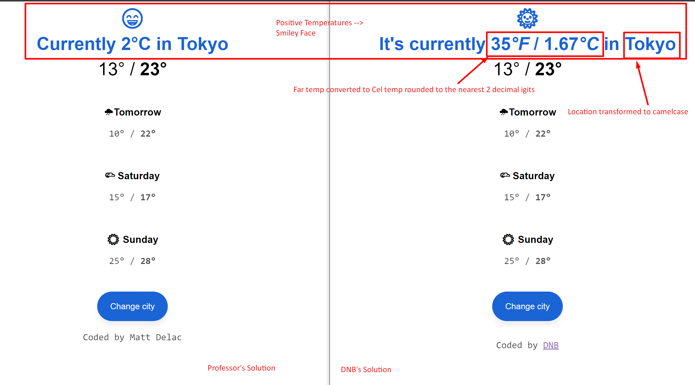
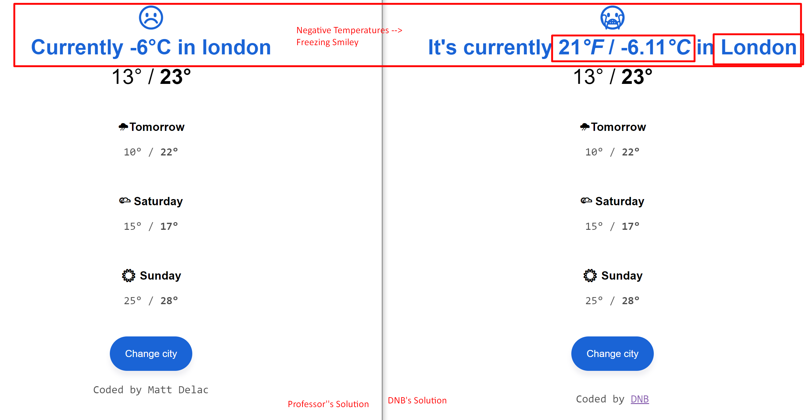
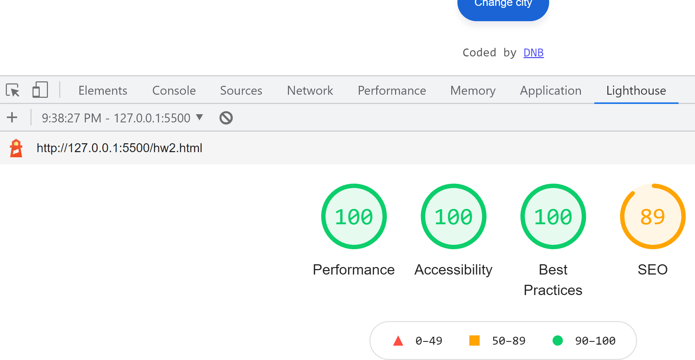

# [SheCodes.io-Week1 - Takeaway](https://dionnenoellabarretto.github.io/shecodes.io-week2/)

## HW2

Reproduce the interaction on the [demo page](https://www.shecodes.io/demos/javascript) using JavaScript & the [starter code](https://gist.github.com/matthieua/7947403b259cf9ecd1b73da0298edfad)

[Professor's Solution](https://gist.github.com/matthieua/c67de99135528487ed789bdfc9c58114)

